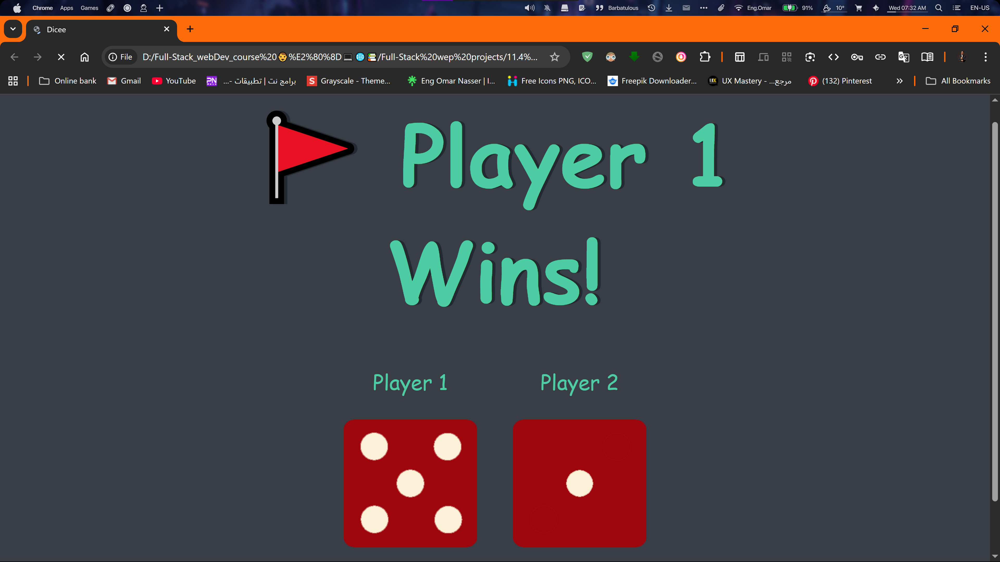
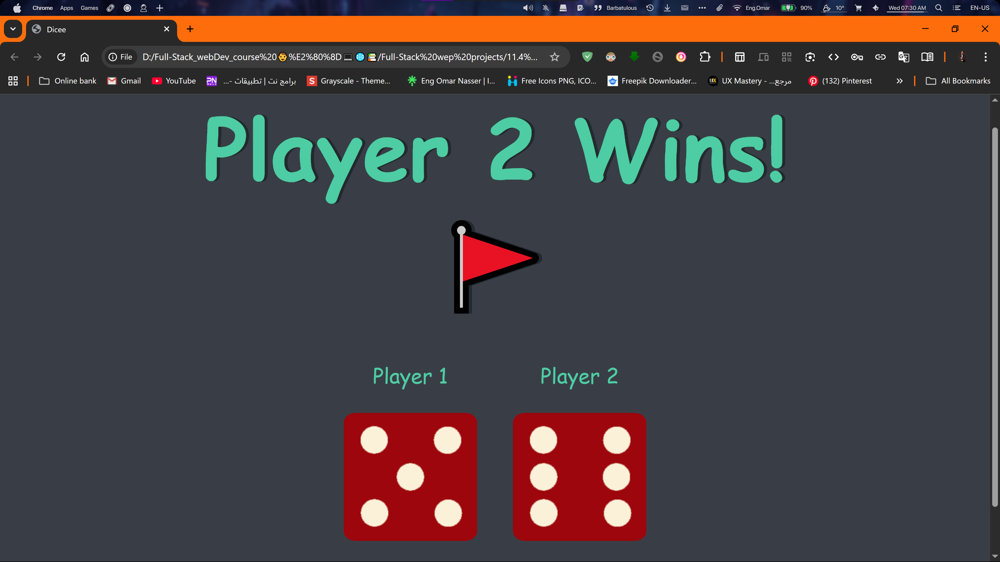
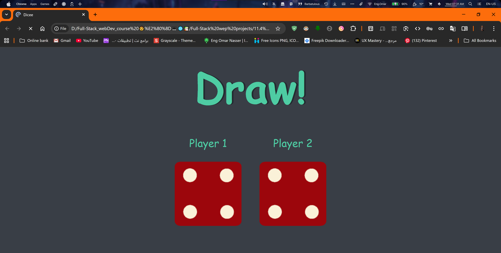

# 🎲 Dice Game Challenge

A simple and interactive 2-player dice game where the winner is declared upon refreshing the page. This project is a classic web development challenge built with **HTML**, **CSS**, and **vanilla JavaScript**.

| Player 1 Wins | Player 2 Wins | Draw |
|---------------|---------------|------|
|  |  |  |


---

## 📐 Features

- ✅ Random dice roll for two players on every page refresh.
- 🏆 Automatic winner, loser, or draw declaration.
- 💻 Clean, centered UI using pure CSS.
- 👨‍💻 Built entirely with vanilla HTML, CSS, and JavaScript (no frameworks).
- 🎲 Dynamic image updates based on JavaScript logic.

---

## 📂 Project Structure

```bash
dice-game-challenge/
│
├── images/
│   ├── dice1.png
│   ├── dice2.png
│   ├── dice3.png
│   ├── dice4.png
│   ├── dice5.png
│   └── dice6.png
│
├── screenshots/
│   └── dice-game.png     # Screenshot for the README
│
├── index.html            # Main page structure
├── styles.css            # Styling for the page
├── index.js              # Game logic
└── README.md             # You're here!

```

---

## 🛠 How to Use

Clone the repository or download the files.

```bash
git clone https://github.com/Omar-eng-sys/Dice-Game.git
cd Dice-Game
```

Open the **index.html** file in your favorite web browser.  

Refresh the page to roll the dice and see the winner!

---

## 📌 Future Improvements

- [ ] Add a "Roll the Dice" button instead of relying on page refresh.  
- [ ] Implement animations for the dice roll.  
- [ ] Add a score counter to track wins for each player.  

---

## 🙌 Credits

- 👨‍💻 Development & Logic: [Eng Omar Nasser]  
- 🎓 Core Project Idea: Based on a challenge from **The App Brewery**.  
- 🛠 Tools Used: HTML5, CSS3, JavaScript.
